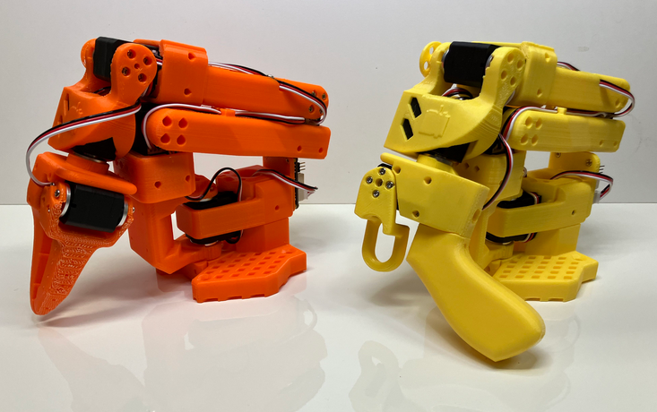

# lerobot

LeRobot: State-of-the-art AI for real-world robotics

SO-ARM100: Standard Open Arm 100

based on STS3215 Servo

* https://github.com/huggingface/lerobot
* https://www.youtube.com/watch?v=n32OmyoQkfs
* https://github.com/TheRobotStudio/SO-ARM100

